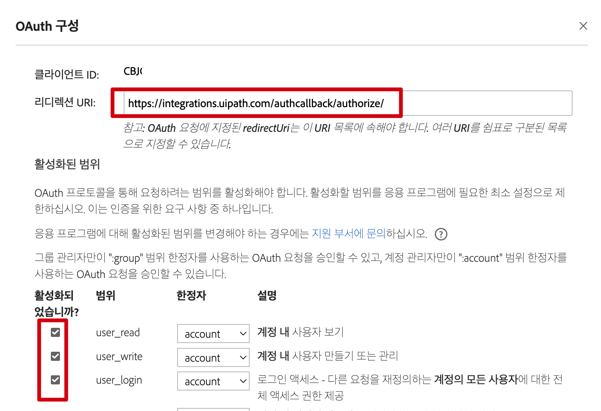

# Adobe Acrobat Sign 및 PDF Service 이용하기 
 
Adobe Acrobat Sign과 PDF 서비스 구성하기  
 
## 준비단계 
- Adobe Sign 계정에서 OAuth 어플리케이션 등록하기  
- Adob Sign ClientID 와 ClientSecret 사용하기 
- PDF Service 개발자 도구에서 인증 등록하기 

### 1. Adobe Acrobat Sign OAuth 등록하기 
아래 그림처럼 Adobe Sign 사이트 로그인 > 계정 선택 

Acrobat Sign API 선택 후  API 응용 프로그램 선택 

새로운 OAuth 응용 프로그램 성성후 리다이렉션 URL에 (https://integrations.uipath.com/authcallback/authorize/) 입력 후 필요한 항목에 대해서 활성화 선택 

### 2. Adobe Sign ClientID 와 ClientSecret 사용하기 
아래 그림과 같이 Adobe Sign Scope에서  Base URL을  https://api.na4.adobesign.com 사용하고 필요한 clientId 및 clientSecret 사용 
clientSecret은 SecureString이여 Credential을 사용하는 것이 편리 함  
  
예제에서는 Adobe Folder에 AbobeSignCredential 을 사용함  
 
